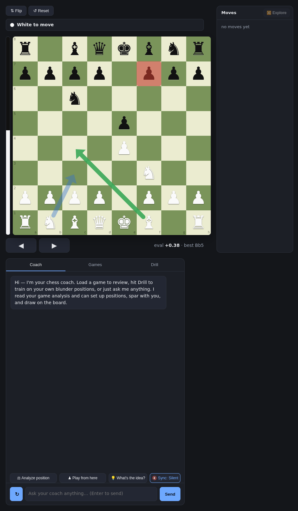

# ChessCoach


A self-hosted chess-improvement app for Chess players. So i and you don't have to pay any subscritption anywhere.
It pulls your Chess.com games,runs every one through Stockfish, surfaces the mistakes you actually make,
 and pairs that with an AI coach that explains *why* and gives you drills — all in a local web UI with a
board, game review, and training.

**The idea:** at 1000–1800 you rarely lose to deep strategy — you lose to the same handful
of mistakes over and over. Find those patterns, drill them out, and the rating follows.

- **Stockfish** finds *what* went wrong — objective eval, no hallucination.
- **The AI coach** explains *why* it went wrong and *what to drill* — and it can set up
  positions, spar with you, and draw weighted arrows on the board.



## Features

- **Dashboard** — rating chart, a weekday training streak, recommended drills, your last games.
- **Analyze** — a free board with live Stockfish eval and non-destructive variation exploring.
- **Review** — step through your analyzed games with every blunder flagged.
- **Drill** — solve the real positions where you threw a game (graded live by the engine),
  plus a dedicated endgame-conversion mode.
- **Play** — spar the engine at an adjustable level.
- **Coach chat** — grounded in your game history; it drives the board (set up a position,
  play a line, start a game) and draws **weighted annotations** (bold = main idea, faint = a
  lesser one).
- **Progress report** — a before/after comparison around your training start, rebuilt on
  every sync so you can watch the trend.
  **Whatever You think Is great** — Feel free to add, modify or scrap whatever you want.

## Requirements

- **Python 3.10+** (on Windows the installer can set it up for you — see below).
- **Stockfish** — the installer downloads it automatically. Or install it yourself
  (`brew install stockfish` / `sudo apt-get install stockfish`), put a `stockfish` binary on
  your `PATH`, or point `STOCKFISH_PATH` at one.
- **An AI-coach backend is optional** — the board, engine eval, review and drills all work
  without one; only the chat needs it. You pick one later in **⚙ Settings**: the Claude Code
  CLI (your subscription), an Anthropic API key, or a local Ollama model.

## Install & run

First get the code: `git clone <your-repo-url> chesscoach` (or download the ZIP from GitHub
and unzip it), then follow your platform.

### Windows

**Double-click `ChessCoach.bat`.** The first run installs everything — a Python virtualenv,
the dependencies, and Stockfish — then starts the app and opens your browser. No WSL and no
admin rights needed. If Python isn't installed it tries to install it via `winget`;
otherwise get it from [python.org](https://www.python.org/downloads/) (tick *Add python.exe
to PATH*) and double-click again. Close the window to stop the server; double-click again to
restart (later launches are instant).

### macOS / Linux / WSL

```bash
cd chesscoach
./setup.sh          # creates a venv, installs dependencies, downloads Stockfish
./serve start       # start the server   (also: ./serve stop | status | logs)
```

No sudo is needed for the Stockfish download on common platforms (Linux x86-64, macOS Intel
and Apple Silicon). On other architectures the installer falls back to your package manager.

### First run

Open **http://127.0.0.1:6464**:

1. Enter your **Chess.com username** and click **Fetch & analyze my games**. The first
   analysis takes a while (Stockfish evaluates every position of every game) and runs in the
   background — the dashboard fills in as it finishes.
2. Optionally open **⚙ Settings** to choose your coach backend.

Pull new games any time with the dashboard's **Sync & analyze** button.

## The command-line pipeline (optional)

The UI wraps these; you can also run them directly:

```bash
python -m coach.fetch_games YOUR_USERNAME --months 3   # pull games from Chess.com
python -m coach.analyze                                 # Stockfish pass (--workers N to parallelize)
python -m coach.report                                  # cluster mistakes into patterns
python -m coach.sessions                                # tilt / session analysis
python -m coach.endgame_conversion                      # build winning-endgame drills
python -m coach.progress                                # before/after progress report
```

## Configuration

- Your **Chess.com username** and **coach backend** are set in the UI (**⚙ Settings**) and
  stored in `config.json` — which is gitignored, because it may hold your API key. Never commit it.
- The **port** is `COACH_PORT` (default `6464`); copy `serve.conf.example` to `serve.conf` to change it.

### Choosing a backend

| Backend | Cost | Setup | Quality |
|---|---|---|---|
| Claude Code subscription | your Claude plan | install + log into the `claude` CLI | best |
| Anthropic API | pay per token | paste an API key in Settings | best |
| Local Ollama | free | run Ollama and pull a model | good on a capable model + GPU; weaker on small local models |

## Layout

```
coach/          the pipeline + FastAPI web server
coach/web/      server + the single-page UI (static/)
data/           your pulled games + Stockfish results (gitignored)
journal/        profile.md (you edit) + auto-generated reports
```

## Notes

- Everything runs locally and binds to `127.0.0.1` — nothing is exposed to your network.
- Games come from the Chess.com **public** API — no password required.
- **Windows:** `ChessCoach.bat` installs (on first run) and launches everything natively —
  no WSL required. Optionally, `setup-url.bat` (run once as admin) maps a clean
  `http://chesscoach` URL.

## Uninstall

ChessCoach lives entirely in its own folder. To remove what it created (the virtualenv,
the downloaded engine, and your games / config / generated reports), keeping the source:

- **Windows:** double-click **`uninstall.bat`**.
- **macOS / Linux / WSL:** `./uninstall.sh`.

Then delete the folder to remove it completely. Neither uninstaller touches Python; if the
Windows installer added it, remove it via *Settings → Apps*.

## License

**GNU General Public License v3.0 or later** (GPL-3.0-or-later) — see [`LICENSE`](LICENSE).
Copyright © 2026 RuneShark.

ChessCoach builds on two copyleft projects — the [python-chess](https://github.com/niklasf/python-chess)
library (used directly) and the [Stockfish](https://stockfishchess.org/) engine (both
GPL-3.0-or-later) — so the project as a whole is distributed under the GPL.

### Third-party components
- **python-chess** — GPL-3.0-or-later (Python library, imported)
- **Stockfish** — GPL-3.0-or-later (engine; downloaded at setup, not bundled)
- **chess.js** (`coach/web/static/chess.min.js`) — BSD-2-Clause, © 2020 Jeff Hlywa
- **FastAPI, Starlette, Pydantic, AnyIO, Anthropic SDK** — MIT
- **Uvicorn, httpx** — BSD-3-Clause
- **Requests** — Apache-2.0
